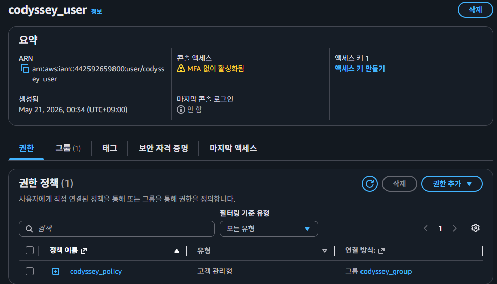
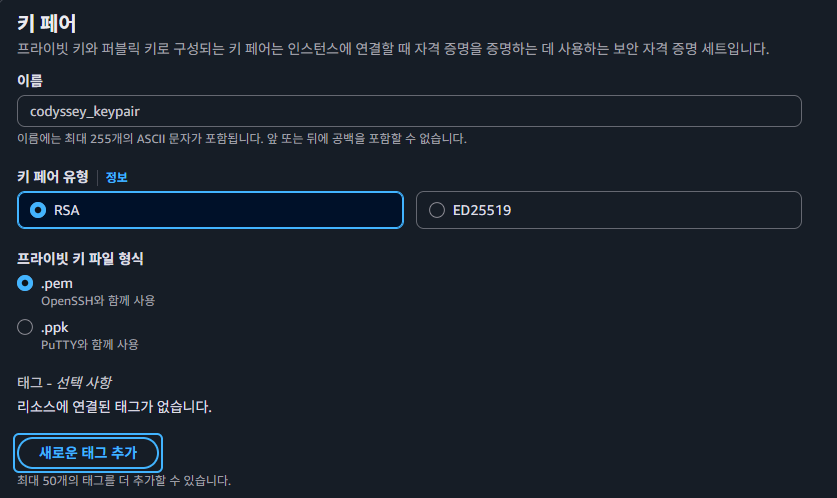

# B6-1 클라우드 환경에서 웹 서비스 인프라 구축

### 사전 준비 (IAM & KeyPair)

- 루트 계정 대신 사용할 IAM 사용자(또는 Role)를 생성합니다. (AdministratorAccess 금지, EC2/VPC 관련 필요 권한만 부여)
- 
    - IAM 사용자 생성 (codyssey_user)
    - 그룹에 사용자 추가 (codyssey_group)
    - 그룹에 정책 연결 (codyssey_policy)
    ```json
        {
    "Version": "2012-10-17",
    "Statement": [
        {// Resorce에 대해 Action을 Effect한다.
        //vpc, 서브넷, 인터넷 게이트웨이, 라우팅테이블 설정 위한 권한
            "Sid": "VPCAndNetworkPermissions", //규칙 이름
            "Effect": "Allow", //Action을 허용 혹은 거부함
            "Action": [ //허용 혹은 금지될 행위
                "ec2:CreateVpc",
                "ec2:DescribeVpcs",
                "ec2:DeleteVpc",
                "ec2:ModifyVpcAttribute",
                "ec2:CreateSubnet",
                "ec2:DescribeSubnets",
                "ec2:DeleteSubnet",
                "ec2:ModifySubnetAttribute",
                "ec2:CreateInternetGateway",
                "ec2:DescribeInternetGateways",
                "ec2:AttachInternetGateway",
                "ec2:DetachInternetGateway",
                "ec2:DeleteInternetGateway",
                "ec2:CreateRouteTable",
                "ec2:DescribeRouteTables",
                "ec2:CreateRoute",
                "ec2:DeleteRoute",
                "ec2:AssociateRouteTable",
                "ec2:DisassociateRouteTable",
                "ec2:DeleteRouteTable"
            ],
            "Resource": "*" //Action의 대상 (전체 허용 의미)
        },
        {//인바운드 규칙 생성 및 삭제 위한 권한
            "Sid": "SecurityGroupPermissions",
            "Effect": "Allow",
            "Action": [
                "ec2:CreateSecurityGroup",
                "ec2:DescribeSecurityGroups",
                "ec2:AuthorizeSecurityGroupIngress",
                "ec2:RevokeSecurityGroupIngress",
                "ec2:DeleteSecurityGroup"
            ],
            "Resource": "*"
        },
        { //EC2 인스턴스 사용 및 접속 키페어 구성, 퍼블릭 ip 연동등에 사용
            "Sid": "EC2AndElasticIPPermissions",
            "Effect": "Allow",
            "Action": [
                "ec2:RunInstances",
                "ec2:DescribeInstances",
                "ec2:TerminateInstances",
                "ec2:CreateKeyPair",
                "ec2:DescribeKeyPairs",
                "ec2:DeleteKeyPair",
                "ec2:AllocateAddress",
                "ec2:DescribeAddresses",
                "ec2:AssociateAddress",
                "ec2:DisassociateAddress",
                "ec2:ReleaseAddress"
            ],
            "Resource": "*"
        },
        { //AWS 자원 생성 시 name tag (별명) 붙일 시 사용
            "Sid": "TaggingPermissions",
            "Effect": "Allow",
            "Action": [
                "ec2:CreateTags",
                "ec2:DescribeTags",
                "ec2:DeleteTags"
            ],
            "Resource": "*"
        }
        ]
    }
    ```

- 서울 리전(ap-northeast-2) 확인 후 EC2 접속을 위한 Key Pair를 생성 및 다운로드합니다.
- 
    - 키페어는 왜 필요한가? : EC2 인스턴스 접속 시 정상 유저임을 입증하기 위한 보안 수단.
        - 비대칭키 암호화 RSA 사용으로 일치하는 key 가지지 않은 USER의 접속을 차단하는 방식
    - .pem이란? : aws 기본 확장자, openssh에서 주로 사용
    - .ppk이란? : 윈도우 전용 프로그램 putty의 전용 형식


### 네트워크 구성 (VPC & Subnet)

- 10.0.0.0/16 대역 등으로 VPC를 생성합니다.

- 10.0.1.0/24 대역 등으로 Public Subnet을 생성합니다.

- Internet Gateway(IGW)를 생성하고 VPC에 연결(Attach)합니다.

- Public Subnet과 연결된 Route Table에 0.0.0.0/0의 대상을 IGW로 설정하여 퍼블릭 라우팅을 구성합니다.

### 보안 그룹 (Security Group) 설정

- 인바운드 규칙 1: HTTP (80) 포트는 0.0.0.0/0 (모두) 허용.

- 인바운드 규칙 2: SSH (22) 포트는 본인의 현재 퍼블릭 IP로만 제한.

### 컴퓨트 자원 배포 (EC2)

- t2.micro 또는 t3.micro 인스턴스를 Public Subnet에 생성합니다. (OS: Ubuntu 또는 Amazon Linux)

- 퍼블릭 IP 자동 할당을 활성화하거나, 생성 후 Elastic IP를 연결합니다.

- 위에서 만든 보안 그룹과 Key Pair를 지정하여 생성합니다.

### 웹 서버 구성 및 검증

- SSH로 접속하여 Nginx를 설치하고 실행합니다. (예: sudo apt update && sudo apt install nginx -y)

- 외부 브라우저에서 퍼블릭 IP로 접속하여 정상 응답(200 OK)을 확인하고 스크린샷을 찍습니다.

### 문서화 및 다이어그램 작성

- draw.io 등을 활용해 아키텍처 다이어그램(docs/architecture.png)을 그립니다.

- 트러블슈팅 문서와 접속 증빙 README를 작성합니다.

### 리소스 정리 (Cleanup)

- 과금 방지를 위해 생성 역순으로 모든 리소스를 삭제하고 체크리스트를 작성합니다.